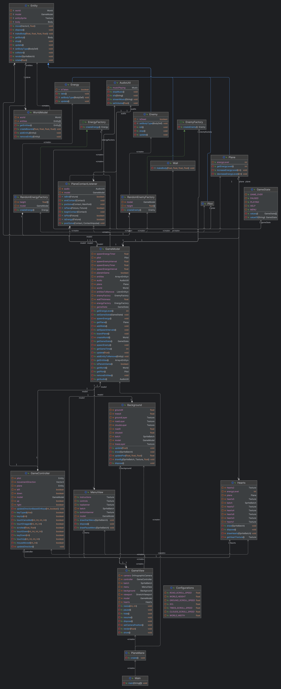

# Rapport – innlevering 2

**Team:** _4GILE_ – _Magnus Haaland, Ida Karoline Løken, Ole Eiane, Hanna Søndenaa Rasmussen_

# Prosjektrapport

## Hvordan fungerer rollene i teamet?

Rollene i teamet vårt fungerer ganske bra. Vi trengte ikke oppdatere team lead (Hanna), tech lead (Magnus) eller kundekontakt (Ole), men vi ønsket å spesifisere rollen til Ida til å bli project lead. Det vi legger i det er at hun har overordnet ansvar for å passe på at alt er som det skal når det gjelder innlevering. Hun passer overordnet på at ansvaret er fordelt og at alt innhold er klart når vi skal levere.

## Hva legger vi i rollene våre?

Team lead - For meg betyr rollen min at jeg har ansvar for at alle får gjort det de kan for prosjektet og at arbeidsoppgavene blir fordelt. I tillegg til referater og generell oversikt.

Tech lead - For meg betyr techlead at jeg har ansvar for at alt i git fungerer som det skal. Jeg har orden på branches, på tix og overordnet ansvar for commits og merges. Det er også alltid godt å ha en å skylde på om "shit hits the fan" :)

Kundekontakt - Jobben som kundekontakt handler om at jeg skal ha en overordnet oversikt over hva kunden forventer av vårt spill. Det vil si at jeg skal ha kontroll på hvilken funksjonalitet vår målgruppe ønsker. En måte å oppnå dette på, har vært å legge seg tett opp mot brukerhistoriene våre for å etablere et grunnlag for hva våre kunder ønsker.

Project lead - For meg betyr rollen min at jeg har ansvar for at frister blir overholdt og at vi møtes i god tid før fristene og jobber jevnt slik at vi slipper skippertak og sene kvelder. I tillegg så sørger jeg for at ansvaret blir fordelt i henhold til hva som skal leveres og gjennomføres.

Vi diskuterte om det kunne vært hensiktsmessig å ha mer "spesifikke" roller som for eksempel grafikkansvarlig, testansvarlig eller produksjonsansvarlig. Vi kom imidlertid til den konklusjon at slike roller ville skapt en form for "silotenking" hvor man lager skiller i hva man kan jobbe med. Det kunne lagt hindringer for sømløst samarbeid på tvers av alle teammedlemmene. Vi så på det som mer hensiktsmessig å lage roller som dekker de fundamentale aspektene ved å jobbe i team for å legge til rette for fordeling av arbeidsppgaver, oppfølging og sist men ikke minst å levere det man skal til riktig tid! Alle teammedlemmene har tross alt god kodekompetanse og kreativitet, og da handlet det fort om å lage gruppesamarbeidet godt nok for å høste fordelene av synergieffekten.

## Erfaringer

Vi fant ut at vår forrige prosjektmetodikk ikke var optimal og har derfor gått bort fra den og har nå bestemt oss for en ny. Den gamle gikk ut på at alle hadde hver sin branch vi jobbet i og deretter merget inn i mvc og deretter main. Dette ga en vanskelig og avansert jobb for vår tech lead når det skulle merges fordi vi kunne ha jobbet på samme filer og overskrevet hverandre. Den nye prosjektmetodikken vår går ut på at nye brancher blir laget for hver arbeidsoppgave og de merges inn i main når de er ferdige.

Arbeidsflyten har vært preget av KANBAN-prinsipper. Her har vi brukt Project Board (Gitlab Issue Board), og lagd issues for konkrete arbeidsoppgaver. Dette har gjort det enkelt å delegere oppgaver, og kontinuerlig følge progresjonen i utviklingen vår.

## Gruppedynamikk

Gruppedynamikken er god. Ettersom vi kjenner hverandre godt og er trygge på hverandre, er det enkelt å uttrykke bekymringer ved prosjektet eller å spørre om hjelp. Det er samlet sett lite uenigheter. Her har vi en liste over uenigheter:

Investere i kreative verktøy - Det var en uenighet om vi var villige til å betale for et bilderedigeringsverktøy. Verktøyet skulle bidra til å lage et estetisk spill.

Uenigheter blir ofte løst knirkefritt ved å ha en åpen diskusjon rundt saken. Uenigheter blir som regel løst demokratisk.

## Kommunikasjon

Kommunikasjonen er fin, vi jobber mye sammen når vi møtes og det fungerer bra for oss.

## Retrospektiv

Prosjektstrukturen er grei, men vi føler fortsatt vi jobber med å finne den perfekte løsningen. Mye av jobbingen vår blir sammen, noe som gir oss mye og fungerer bra. Allikevel er det fint å ha mer frihet til å i tillegg kunne jobbe mer individuelt for høyere effektivite og frihet, selv om dette kan føre til overlapp eller forvirring. 

## Forklaring av commits

Mye av vårt arbeid er gjort i fellesskap så mye av koden er parkodet. Resultatet kan være en skjevfordeling av commits.

## Forberdinger

1. Legge til rette for å kunne jobbe mer individuelt.
2. Utforske nye arbeidsverktøy som øker effektiviteten.

# Krav og spesifikasjon

## Prioriterte krav

I første instans prioriterte vi selvsagt å få på plass det mest grunnleggende for et spill. Dette handlet da om å tegne et spillbrett som inkluderer en spiller (flyet) som kan beveges interaktivt ved bruk av WASD-tastene. Men vi ville at spillet skulle være engasjerende fra tidlig av, så vi var raske med å også prioritere dette. Det dreide seg om at spilleren kunne iterragere med terrenget og fiender (fugler) som prøver å hindre spilleren. I tillegg skulle spilleren ha et helsenivå som kunne gå tomt.

Resultatet når det kommer til prioteringen har vært fremragende. Vi føler vi sitter igjen med et produkt som dekker mesteparten av vår MVP. Vi har imidlertid ikke implementert funksjonalitet som gjør at spillet blir vanskeligere over tid. Samlet sett, vil vi si vi ikke er kommet forbi MVP, men vi nærmer oss med stormskritt!

Vi har blant annet sett på Petras brukerhistorie om tilgjengelighet for venstrehendte. Her satte vi opp en oppgave om å tillate bruk av WASD-taster, og akseptansekravet ble da simpelthen at bevegelse skulle styres av nettopp disse tastene. Vi vil senere lage en test for dette.

Fremover vil vi prioritere klar separasjon og abstraksjon i koden for å forsterke spillarkitekturen. Ved å skille funksjonaliteter og innføre interfaces, sikter vi mot et mer modulært og tilpasningsdyktig spill. Dette tilnærmingen vil ikke bare forbedre vår bruk av LibGDX, men også forenkle vedlikehold og fremtidige utvidelser.

## Prioritering av oppgaver fremover

Ettersom vi har dekket mye av vår MVP, vil det fremover prioriteres oppgaver som enda ikke er nevnt. Dette kan dreie seg om introduksjon av flere ulike typer fiender.

En konkret oppgave vi imidlertid vil prioritere fremover er å gjøre spillet enda mer engasjerende ved å muliggjøre at spillet øker i vanskelighetsgrad. Denne arbeidsoppgaven kommer frem ved Kristians brukerhistorie.

I det videre arbeidet vårt ser vi viktigheten av å fokusere på separasjon og abstraksjon for å forbedre koden vår. Med mål om å skape et mer modulært og fleksibelt spill, ønsker vi å separere funksjonaliteter tydelig og bruke abstraksjoner, spesielt gjennom interfaces. Dette vil hjelpe oss med å bedre forstå og utnytte LibGDX-rammeverket, samtidig som det legger grunnlag for enklere vedlikehold og utvidelse av spillet.

## Bugs

Det er noen bugs her og der som kan merkes om man spiller spillet. Det kan blant annet av og til hende at man starter et spill hvor man kun beveger piloten i terrenget, og flyet og fiender dukker aldri opp.

# Produkt og kode

Vi har som nevnt et ønske om å blant annet lage en test for at flyet beveger seg i riktig retning avhengig av hvilken tast som trykkes. Det vil selvsagt lages flere tester senere i utviklingsfasen, noe som blir en priotering fremover.

Her er klassediagrammet vårt:

## Utbedring av feil

Vi fant ut underveis at måten vi har skrevet vår kode ikke passet veldig bra med libgdx, derfor har vi med utgangspunkt i vår kode og mer forståelse av rammeverket, prøvd å starte prosjektet på nytt. Dette er for bedre kodestil, abstraksjon og MVC prinsipper.
