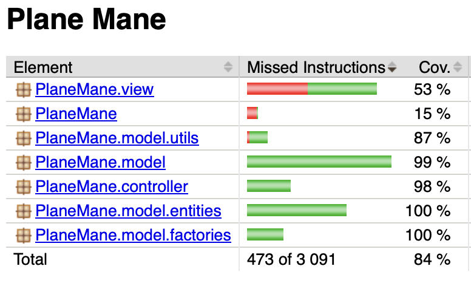
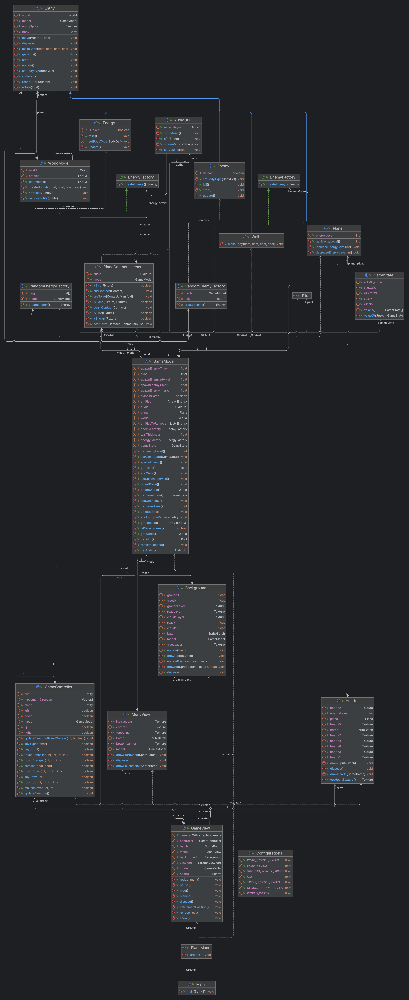

# Rapport – innlevering 4

**Team:** _4GILE_ – _Magnus Haaland, Ida Karoline Løken, Ole Eiane, Hanna Søndenaa Rasmussen_

Referater kan finnes i [referater.md](referater.md). Relevante referater for oblig4 vil være fra ca. 12.04.2024 - 03.05.2024.
# Prosjektrapport
---
## Hvordan fungerer rollene i teamet?

Rollene i teamet vårt fungerer ganske bra. Vi trengte ikke oppdatere team lead (Hanna), tech lead (Magnus), kundekontakt (Ole) eller project lead (Ida).

## Hva legger vi i rollene våre?

Team lead - For meg betyr rollen min at jeg har ansvar for at alle får gjort det de kan for prosjektet og at arbeidsoppgavene blir fordelt. I tillegg til referater og generell oversikt.

Tech lead - For meg betyr techlead at jeg har ansvar for at alt i git fungerer som det skal. Jeg har orden på branches, på tix og overordnet ansvar for commits og merges. Det er også alltid godt å ha en å skylde på om "shit hits the fan" :)

Kundekontakt - Jobben som kundekontakt handler om at jeg skal ha en overordnet oversikt over hva kunden forventer av vårt spill. Det vil si at jeg skal ha kontroll på hvilken funksjonalitet vår målgruppe ønsker. En måte å oppnå dette på, har vært å legge seg tett opp mot brukerhistoriene våre for å etablere et grunnlag for hva våre kunder ønsker.

Project lead - For meg betyr rollen min at jeg har ansvar for at frister blir overholdt og at vi møtes i god tid før fristene og jobber jevnt slik at vi slipper skippertak og sene kvelder. I tillegg så sørger jeg for at ansvaret blir fordelt i henhold til hva som skal leveres og gjennomføres.

Vi diskuterte om det kunne vært hensiktsmessig å ha mer "spesifikke" roller som for eksempel grafikkansvarlig, testansvarlig eller produksjonsansvarlig. Vi kom imidlertid til den konklusjon at slike roller ville skapt en form for "silotenking" hvor man lager skiller i hva man kan jobbe med. Det kunne lagt hindringer for sømløst samarbeid på tvers av alle teammedlemmene. Vi så på det som mer hensiktsmessig å lage roller som dekker de fundamentale aspektene ved å jobbe i team for å legge til rette for fordeling av arbeidsppgaver, oppfølging og sist men ikke minst å levere det man skal til riktig tid! Alle teammedlemmene har tross alt god kodekompetanse og kreativitet, og da handlet det fort om å lage gruppesamarbeidet godt nok for å høste fordelene av synergieffekten.

## Erfaringer

**Oblig 2:**

Vi fant ut at vår forrige prosjektmetodikk ikke var optimal og har derfor gått bort fra den og har nå bestemt oss for en ny. Den gamle gikk ut på at alle hadde hver sin branch vi jobbet i og deretter merget inn i mvc og deretter main. Dette ga en vanskelig og avansert jobb for vår tech lead når det skulle merges fordi vi kunne ha jobbet på samme filer og overskrevet hverandre. Den nye prosjektmetodikken vår går ut på at nye brancher blir laget for hver arbeidsoppgave og de merges inn i main når de er ferdige.

Arbeidsflyten har vært preget av KANBAN-prinsipper. Her har vi brukt Project Board (Gitlab Issue Board), og lagd issues for konkrete arbeidsoppgaver. Dette har gjort det enkelt å delegere oppgaver, og kontinuerlig følge progresjonen i utviklingen vår.

**Oblig 3:**

Etter hvert som vi har kommet lenger i prosjektarbeidet har vi gått tilbake til den originale prosjektmetodikken som beskrevet over. Vi jobber nå med hver vår branch, og merger inn i main når vi anser det som formålstjenlig. Dette har blitt muliggjort ettersom vi har kommet lenger i prosjektarbeidet, og arbeidsoppgavene følgelig har blitt mer konkret.

**Oblig 4:**

Intet å tilføye utover det som er nevnt under oblig3.

## Gruppedynamikk

Gruppedynamikken er god. Ettersom vi kjenner hverandre godt og er trygge på hverandre, er det enkelt å uttrykke bekymringer ved prosjektet eller å spørre om hjelp. Det er samlet sett lite uenigheter. Her har vi en liste over uenigheter:

Investere i kreative verktøy - Det var en uenighet om vi var villige til å betale for et bilderedigeringsverktøy. Verktøyet skulle bidra til å lage et estetisk spill.

Uenigheter blir ofte løst knirkefritt ved å ha en åpen diskusjon rundt saken. Uenigheter blir som regel løst demokratisk.

## Kommunikasjon

**Oblig 2:**
Kommunikasjonen er fin, vi jobber mye sammen når vi møtes og det fungerer bra for oss.

**Oblig 3:**
Jobbingen med oblig 3 har i større grad enn tidligere vært remote. Dette har selvsagt skapt utfordringer med kommunikasjonen. Disse utfordringene har likevel blitt håndtert godt, takket være tydelige meldinger og videosamtaler om hva vi arbeider med. Ved å fokusere ekstra på kommunikasjon, har vi løst utfordringene på en effektiv måte!

**Oblig 4:**
Intet å tilføye.

## Retrospektiv

**Oblig 2:**
Prosjektstrukturen er grei, men vi føler fortsatt vi jobber med å finne den perfekte løsningen. Mye av jobbingen vår blir sammen, noe som gir oss mye og fungerer bra. Allikevel er det fint å ha mer frihet til å i tillegg kunne jobbe mer individuelt for høyere effektivite og frihet, selv om dette kan føre til overlapp eller forvirring. 

**Oblig 3:**
Progresjonen i applikasjonen vår har gjort at vi endelig kan oppleve den høyere effektiviteten som nevnt over. Det har blitt enklere å delegere konkrete arbeidsoppgaver som kan løses uten å vende om på hele kodestrukturen(/logikken). 

**Oblig 4:**
Se litt lenger ned for retrospektiv.

## Forklaring av commits

**Oblig 2:**
Mye av vårt arbeid er gjort i fellesskap så mye av koden er parkodet. Resultatet kan være en skjevfordeling av commits.

**Oblig 3:**
Vi har også opplevd at Ida, som nevnt i referater, har problemer med Git. Dette gjorde at skjevfordelingen av commits ble noe tydeligere. Problemene har etter hvert avtatt, og vi ser en mer jevn fordeling av commits nå!

**Oblig 4:**
Vi mener vi samlet sett har endt opp med en god fordeling av commits! ⚖️

## Forbedringer

**Oblig 2:**
1. Legge til rette for å kunne jobbe mer individuelt.
2. Utforske nye arbeidsverktøy som øker effektiviteten.

**Oblig 3:**
Vi vil anse punkt 1 som innfridd. Som gjennomgående nevnt over, har vi ved progresjonen i prosjektarbeidet vært i stand til å jobbe med konkrete og "isolerte" arbeidsoppgaver. Resultatet har blitt mer individuell jobbing. 

Vi har imidlertid ikke funnet noen arbeidsverktøy som øker effektiviteten. Vi føler imidlertid at effektiviteten har nådd et tilfredsstillende nivå, så nye arbeidsverktøy kan kanskje strykes fra ønskelisten for forbedringer 🤔. 

Videre ønsker vi å forbedre oss på følgende:
1. Sette klare forventninger for hver innlevering helt fra starten av.

Det vi legger i det punktet, er at vi ønsker å sette klare føringer for hva vi bør/må prioritere til hver innlevering. Dette kan gjøre oss i stand til å prioritere riktig inn mot innlevering der tiden ofte kan bli knapp.

**Oblig 4:**
Vi mener vi klarte å levere på forbedringspunktet nevnt under oblig 3. Vi ble enige om hva vi forventet av sluttproduktet, og er nå klar for å levere inn med et par dager til innleveringsfrist. (Og vi kan med det nyte uvurderlige soldager i Bergen istedenfor å kjempe mot klokka🍻🌞)

## Oblig 4 – Retrospektiv for prosjektet

### Hva har vi gjort bra? 

**Teamarbeid og roller:**
Vårt samarbeid har vært vår styrke gjennom prosjektet. Vi definerte klare roller tidlig i prosjektet, noe som hjalp med å fordele arbeidet effektivt og sikre at alle hadde et klart ansvar. Her kan vi blant annet trekke frem en omfattende "bestilling" (Semesteroppgave (innlevering, vurdering)) av Anya Helene Bragge med mange krav og forventninger til sluttproduktet. Her var det dermed avgjørende å ha noen med ekstra ansvar for at vi alltid leverer i tråd med det som er bestilt. Samlet sett gjorde dette oss i stand til å møte deadlines og håndtere utfordringer effektivt. 

**Teknologi og verktøyvalg:**
Valget av libGDX og implementasjonen av Asset Manager var avgjørende for å håndtere ressurser på en effektiv måte. Dette ga oss en stabil og robust plattform for utvikling. Verktøy som Git har også gjort samarbeidet svært vellykket. 

**God evne til å kaste oss rundt og tilpasse oss:**
Vi har hatt en god evne til å tilpasse oss og endre vår utviklingsmetodikk gjennom prosjektet. Det har tillatt oss å være responsive til utfordringer. Her kan vi blant annet trekke frem overgangen fra den mindre effektive kodebase til den mer modulære og godt organiserte arkitekturen.

### Hva ville vi gjort annerledes?

**Sterkere kodebase fra starten av:**
Vi ville investert mer tid i å etablere en solid og gjennomtenkt arkitektur fra starten av. Selv om vi forbedret vår kodebase, førte starten til utfordringer som kunne vært unngått. 

**Forbedret testing fra starten av:**
Vi innførte testing litt sent i prosjektet. Hvis vi hadde startet tidligere med tester kunne det ha hjulpet oss med å identifisere og løse problemer raskere, og sikret høyere kodekvalitet.

**Bedre håndtering av remote arbeid:**
Selv om vår tilnærming til remote arbeid fungerte ganske godt, kunne vi ha lagt til rette for at alle teammedlemmer følte seg like involvert og oppdatert uavhengig om man er tilstede eller ikke. 

----
### 👉 Konklusjon

Alt i alt har dette prosjektet vært en verdifull læringsopplevelse for hele teamet. Vi har utviklet både tekniske ferdigheter og evnen til å arbeide effektivt i team. Vi tar dette med oss videre, og det kan absolutt komme oss til gode i fremtidige prosjekter. Vi er takknemlige for en spennende og givende semesteroppgave, og vi takker Anya Helene Bragge og gruppeledere for dette! 🚀

# Krav og spesifikasjon
---
## Prioriterte krav

**Oblig 2**:
I første instans prioriterte vi selvsagt å få på plass det mest grunnleggende for et spill. Dette handlet da om å tegne et spillbrett som inkluderer en spiller (flyet) som kan beveges interaktivt ved bruk av WASD-tastene. Men vi ville at spillet skulle være engasjerende fra tidlig av, så vi var raske med å også prioritere dette. Det dreide seg om at spilleren kunne interragere med terrenget og fiender (fugler) som prøver å hindre spilleren. I tillegg skulle spilleren ha et helsenivå som kunne gå tomt.

Resultatet når det kommer til prioriteringen har vært fremragende. Vi føler vi sitter igjen med et produkt som dekker mesteparten av vår MVP. Vi har imidlertid ikke implementert funksjonalitet som gjør at spillet blir vanskeligere over tid. Samlet sett, vil vi si vi ikke er kommet forbi MVP, men vi nærmer oss med stormskritt!

Vi har blant annet sett på Petras brukerhistorie om tilgjengelighet for venstrehendte. Her satte vi opp en oppgave om å tillate bruk av WASD-taster, og akseptansekravet ble da simpelthen at bevegelse skulle styres av nettopp disse tastene. Vi vil senere lage en test for dette.

Fremover vil vi prioritere klar separasjon og abstraksjon i koden for å forsterke spillarkitekturen. Ved å skille funksjonaliteter og innføre interfaces, sikter vi mot et mer modulært og tilpasningsdyktig spill. Denne tilnærmingen vil ikke bare forbedre vår bruk av LibGDX, men også forenkle vedlikehold og fremtidige utvidelser.

**Oblig 3**:
Etter vår fremgang i prosjektarbeidet, har vi nå oppnådd en god grad av separasjon og abstraksjon. Dette er noe vi har hatt høyt på prioriteringslisten. Vi har blant annet abstrahert klassen for Enemy. Det gjorde oss i stand til å gjenbruke kode og skape modularitet. Vi kunne da skille vår opprinnelige fugl (hvit fugl som beveger seg lineært) i en egen klasse som utvider Enemy-funksjonalitet.

Dette gjorde oss jo også i stand til å utvide spillet vårt. Det har dermed blitt naturlig for oss å  prioritere kravet om at spillet skal utvikle seg med tid. Vi har derfor lagt til en posisjonssøkende (rosa) fugl som beveger seg i retning av flyets lokasjon. Denne utvider jo Enemy-funksjonalitet, og skiller seg kun ut ved at den har noe ulik bevegelseslogikk.

Vi har også gjort at spillopplevelsen føles mer sømløs ved at det er mulig å trykke *Space* for å restarte spillet etter man får GAME OVER. 

Vi har også gjennomgående hatt et mål om å lage et engasjerende spill. For å kunne levere på dette punktet har vi nå lagt til Score. Vi legger dermed til poengobjekter som man skal bevege seg over for å samle poeng. 

Samlet sett føler vi at vi har kommet oss forbi vår MVP. Som foregående nevnt, manglet vi funksjonalitet som gjør at vanskelighetsgraden øker med tid. Vi føler nå at vi delvis tilfredsstiller dette punktet. De rosa (posisjonssøkende) fuglene introduseres nemlig ikke i spillet før det har gått 15 sekunder. Årsaken til at vi kun delvis har dekket dette punktet er at vanskelighetsgraden ikke øker deretter (i.e. introduksjonen av rosa fulger).

**Oblig 4:**
Vi har nå klart å fullstendig levere på kravet om at vanskelighetsgraden skal øke ettersom man progresserer i spillet. Vi har nå funksjonalitet som gjør at rosa fugler spawner hyppigere enn white birds ettersom man kommer lenger i spillet. Energi- og poengobjekter spawner også hyppigere ettersom tiden passerer.
👉 Vi mener vi har kommet oss forbi vår MVP!

## Prioritering av oppgaver fremover

**Oblig 2:**

Ettersom vi har dekket mye av vår MVP, vil det fremover prioriteres oppgaver som enda ikke er nevnt. Dette kan dreie seg om introduksjon av flere ulike typer fiender.

En konkret oppgave vi imidlertid vil prioritere fremover er å gjøre spillet enda mer engasjerende ved å muliggjøre at spillet øker i vanskelighetsgrad. Denne arbeidsoppgaven kommer frem ved Kristians brukerhistorie.

I det videre arbeidet vårt ser vi viktigheten av å fokusere på separasjon og abstraksjon for å forbedre koden vår. Med mål om å skape et mer modulært og fleksibelt spill, ønsker vi å separere funksjonaliteter tydelig og bruke abstraksjoner, spesielt gjennom interfaces. Dette vil hjelpe oss med å bedre forstå og utnytte LibGDX-rammeverket, samtidig som det legger grunnlag for enklere vedlikehold og utvidelse av spillet.

**Oblig 3:**

Vi har som nevnt klart å levere godt på punktene i argumentasjonen over (oblig 2). Vi har introdusert en ny type fiende, samt at spillet øker i vanskelighetsgrad med tid. Vi har også oppnådd en god grad av separasjon og abstraksjon.

Vi har nå laget abstrakte objektfabrikker. Her har vi blant annet at enemies og energy deler mye av den samme funksjonaliteten.

Vi har til nå laget et par tester for applikasjonen vår. I vårt videre arbeid vil vi imidlertid fokusere enda mer på å lage tester for blant annet akseptansekriteriene våre.

Videre vil vi nok også jobbe mer med punktet om at vanskelighetsgraden øker med tid. Her kan vi jo gjerne sette opp hastigheten på den horisontale scrollingen slik at det blir vanskeligere å unngå fuglene. Eventuelt kan vi øke vanskelighetsgraden ved å fylle terrenget med et høyere antall fugler.

En annen prioritering er å få til Highscore, som gir den høyeste scoren man har fått i spillet. Dette vil gjøre oss i stand til å levere et spill som engasjerer.

**Oblig 4:**

Denne delen av prosjektet har i all hovedsak dreid seg om å lage tester for applikasjon, og vi sitter igjen med en solid test coverage! Hele 84%! 🚀 (se også [manuelle tester](manuelletester.md) for ytterligere testing av *View*)

## Oblig 3 – Justering på krav i MVP

Vi har valgt å gjøre en endring i rekkefølge av kravene i MVP. Vi har valgt å sette kravet *"Start-skjerm ved oppstart / game over"* høyere på listen. Vi har også valgt å legge noe til ordlyden her. Kravet vil fra nå av være tydeligere ved at det er *"Start-skjerm ved oppstart / game over med tydelige instrukser for hva som skal gjøres"*. 

Vi valgte å gjøre dette etter møter med kunder. Vi lot potensielle kunder spille spillet vårt for å identifisere hva brukergruppen faktisk måtte ønske av funksjonalitet og forbedringer. I disse møtene fremkom det hovedsakelig:

1. Noen klarte ikke å starte spillet, trykket P fordi det sto på startskjermen at det setter spillet i en Play/Pause state (dette skjer ikke før spillet faktisk er startet).
	* (Spillet startes ved å bevege piloten slik at den treffer flyet)
2. Skjønte ikke at piloten skulle beveges inn i flyet

Vi ser av dette at det foreligger alvorlige misforståelser som gjør at flere ikke engang klarer å starte spillet vårt. Det gjør at vi må prioritere å lage en start-skjerm med gode og forståelige instrukser. Dette vil jo også gjøre oss i stand til å levere enda bedre på akseptansekriteriet knyttet til Karstens brukerhistorie: Konkrete og enkle startinstrukser.

## Bugs

**Oblig 2:**
Det er noen bugs her og der som kan merkes om man spiller spillet. Det kan blant annet av og til hende at man starter et spill hvor man kun beveger piloten i terrenget, og flyet og fiender dukker aldri opp.

**Oblig 3:**
Funksjonaliteten vår som gjør at vi har Score, gir opphav til noe buggy oppførsel. Selve scoren tegnes ikke riktig. Scoren skal økes med 100 for hvert poeng man plukker, men 0 tallene tegnes over hverandre. 

Etter man restarter spillet og starter på nytt spilles GAME OVER - musikken.

Ingen lydhendelse når vi plukker opp poengobjekter.

Timeren starter med en gang man kommer inn i Welcome Screen. Det gjør at hvis man venter 15 sekunder i denne STATEen så vil rosa fugler spawne med én gang man starter spillet.

**Oblig 4:**
Etter man restarter spillet kan det hende at man mister liv av "usynlige fugler".

Når man har oppnådd 1100 poeng så står det 110 istedenfor 1100.

# Produkt og kode
----

**Oblig 2:**
Vi har som nevnt et ønske om å blant annet lage en test for at flyet beveger seg i riktig retning avhengig av hvilken tast som trykkes. Det vil selvsagt lages flere tester senere i utviklingsfasen, noe som blir en prioritering fremover.

Her er klassediagrammet vårt:

**Oblig 3:**

Her er klassediagrammet vårt for oblig 3:

**Oblig 4:**

Her er klassediagrammet vårt for oblig 4:

## Utbedring av feil

**Oblig 2:**
Vi fant ut underveis at måten vi har skrevet vår kode ikke passet veldig bra med libgdx, derfor har vi med utgangspunkt i vår kode og mer forståelse av rammeverket, prøvd å starte prosjektet på nytt. Dette er for bedre kodestil, abstraksjon og MVC prinsipper.

**Oblig 3:**
Dette har vi fikset siden sist:
1. I lys av argumentasjonen over har vi laget kodestruktur som fungerer bra med libGDX.
2. Mulig å restarte spillet etter GAME OVER.
3. Vi har også oppdatert README.MD med relevant informasjon. Her har vi også lagt til at vi kan få tilgang til en JaCoCo test coverage rapport.

**Oblig 4:**
Dette har vi fikset siden sist:
1. Hvis man spammet hvilken som helst tast kunne man få til uønsket bevegelse.
2. Scoren tegnes riktig (utenom 1100 poeng, se under **Bugs**).
3. Riktig musikk spilles av etter man restarter spillet.
4. Vi har nå lydhendelse når man plukker opp poengobjekter.
5. Timeren starter kun når man har startet selve spillet ved å boarde flyet.
6. Vi har også fullført readme.md og pom.xml.

